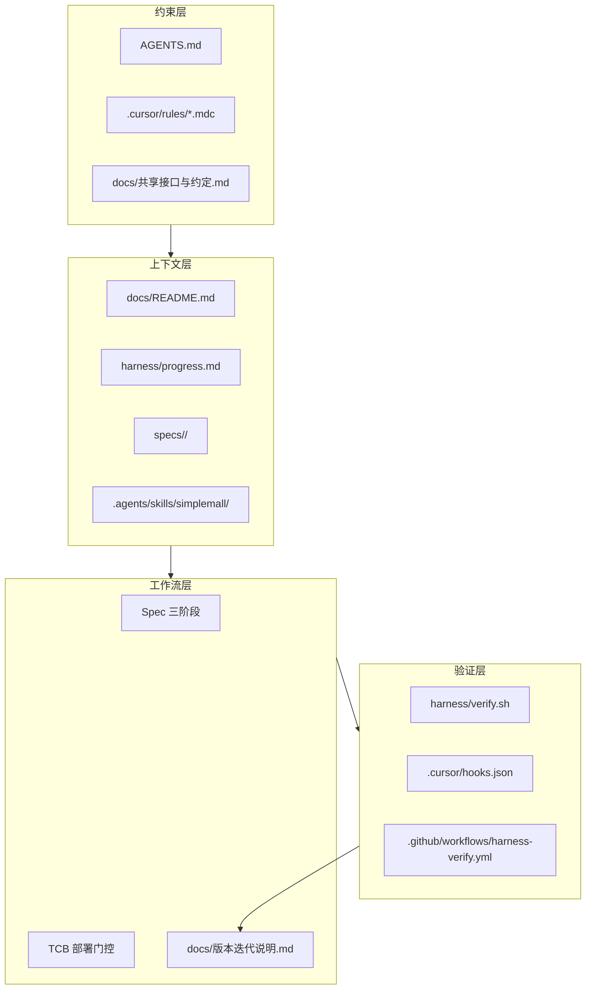

# SimpleMall Harness 工程化体系

> **Harness**（挽具）= 约束 Agent 行为的环境、反馈回路与上下文基础设施。  
> 目标：让 AI 在本 Monorepo 内**可预测、可验证、可交接**地交付代码。

---

## 1. 体系总览



| 层次   | 职责                                | 关键路径                        |
| ------ | ----------------------------------- | ------------------------------- |
| 约束   | 告诉 Agent **能做什么、不能做什么** | `AGENTS.md`、`.cursor/rules/`   |
| 上下文 | 跨会话**记忆**与任务规划            | `harness/progress.md`、`specs/` |
| 工作流 | 中大型任务**分阶段**推进            | Spec 工作流、TCB 部署技能       |
| 验证   | **证明**改动可构建、类型正确        | `harness/verify.sh`、CI         |

---

## 2. Agent 入口与路由

### 2.1 统一入口：`AGENTS.md`

所有 Agent 工具应优先读取根目录 `AGENTS.md`，再按任务类型展开子文档与技能。

### 2.2 Cursor 规则（`.cursor/rules/`）

| 规则                     | 作用域       | 说明                               |
| ------------------------ | ------------ | ---------------------------------- |
| `harness-core.mdc`       | 全局         | Harness 三层、任务路由、交付检查单 |
| `code-comments.mdc`      | 全局         | 中文业务备注规范                   |
| `version-changelog.mdc`  | 全局         | 发版文档同步                       |
| `naming-conventions.mdc` | 全端 TS      | 包名、路由、文件命名               |
| `api-module.mdc`         | `apps/api`   | NestJS 分层与 Prisma               |
| `admin-patterns.mdc`     | `apps/admin` | React Admin 约定                   |
| `web-*`                  | `apps/web`   | 响应式、Tailwind、组合式函数       |

### 2.3 项目技能（`.agents/skills/simplemall/`）

| 技能                        | 触发场景             |
| --------------------------- | -------------------- |
| `SKILL.md`                  | 本仓库内任何开发任务 |
| `references/verify/`        | 交付前自检           |
| `references/spec-workflow/` | 跨模块 / 新功能      |
| `references/deploy-tcb/`    | 腾讯云部署           |

CloudBase 平台能力仍走 `.agents/skills/cloudbase/`。

---

## 3. 上下文持久化

### 3.1 进度交接：`harness/progress.md`

- **会话开始**：Agent 读取当前焦点与阻塞项
- **会话结束**：更新「最近完成」「下一步」
- 类比 Anthropic `claude-progress.txt` / Cursor scratchpad

### 3.2 Spec 工作流：`specs/<name>/`

中大型需求三阶段（**每阶段需用户确认后再进入下一阶段**）：

1. `requirements.md` — EARS 验收标准
2. `design.md` — 模块与 API 设计
3. `tasks.md` — 可勾选任务

模板：`harness/templates/spec-*.md`

---

## 4. 验证闭环

### 4.1 本地命令

```bash
pnpm verify              # types + build
pnpm verify:types        # 仅类型
pnpm verify:build        # 仅构建
./harness/verify.sh all  # 同上
```

**构建验证覆盖**：`shared`（tsc）→ `api`（nest build）→ `admin`（vite build）→ `web`（nuxt build）

### 4.2 Cursor Hooks（`.cursor/hooks.json`）

| 事件                   | 行为                                   |
| ---------------------- | -------------------------------------- |
| `sessionStart`         | 注入 Harness 说明 + `progress.md` 焦点 |
| `beforeShellExecution` | 拦截 `git push -f`、`reset --hard` 等  |
| `stop`                 | 提醒运行 verify 与更新文档             |

### 4.3 CI：`.github/workflows/harness-verify.yml`

Push / PR 时自动运行 `pnpm verify:types`（CI 使用 Node.js 24 + Actions v6 运行时）。

---

## 5. 任务决策树

```text
用户请求
  ├─ 小修复 / 需求明确 → 直接改 → verify:types → 更新 changelog（若有价值）
  ├─ 跨模块 / 新功能 → specs/ 三阶段 → 分 Phase 实现 → verify:all
  ├─ TCB 部署 → deploy-tcb 技能 + TCB部署说明 → verify:all → 部署脚本
  └─ 纯问答 / 读代码 → 不改代码，跳过 verify 与 changelog
```

---

## 6. 与现有文档的关系

| 文档                     | 关系                                    |
| ------------------------ | --------------------------------------- |
| `docs/README.md`         | 人类文档索引；Harness 为其 Agent 侧补充 |
| `docs/共享接口与约定.md` | 接口契约，改 API 必同步                 |
| `docs/版本迭代说明.md`   | 发版记录，有交付价值必更新              |
| `docs/TCB部署说明.md`    | 部署操作细节，配合 deploy-tcb 技能      |

---

## 7. 演进路线

| 阶段  | 内容                                             | 状态     |
| ----- | ------------------------------------------------ | -------- |
| v0.11 | Harness 骨架：规则、技能、verify、hooks、CI      | **当前** |
| 后续  | 关键路径 E2E（Playwright）、pre-commit、契约测试 | 待规划   |
| 后续  | Agent 评测集（golden tasks）                     | 待规划   |

---

## 修订记录

| 版本 | 日期       | 说明                    |
| ---- | ---------- | ----------------------- |
| v1.0 | 2026-06-05 | 初版 Harness 工程化体系 |
