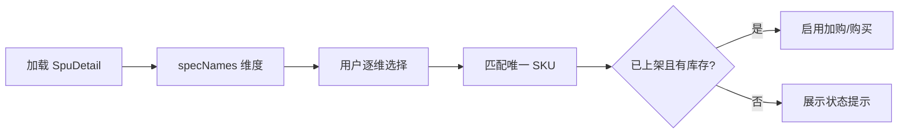

# Web 商城开发设计文档（Nuxt）

> **应用路径**：`apps/web`  
> **技术栈**：Nuxt 3、Vue 3、Pinia、Tailwind CSS（或 UnoCSS）、ofetch  
> **依赖文档**：[架构说明书](./轻量电商系统架构说明书.md)、[共享接口与约定](./共享接口与约定.md)

---

## 1. 职责边界

| 负责 | 不负责 |
|------|--------|
| 商品浏览、详情、规格选择、购物车、结算、订单、模拟支付跳转 | 商品/类目后台维护 |
| 用户注册登录、收货地址 | 支付回调处理（服务端） |
| SEO 友好的列表/详情（SSR） | 库存扣减逻辑 |

---

## 2. 渲染策略

| 页面 | 模式 | 理由 |
|------|------|------|
| 首页、分类、商品列表、商品详情 | **SSR** | SEO、首屏速度 |
| 购物车、结算、订单列表/详情、个人中心 | **CSR**（`definePageMeta({ ssr: false })` 或 client-only） | 强依赖登录态 |
| 登录/注册 | CSR | 避免 token 泄露到 HTML |

**数据获取**：

- SSR 页：`useAsyncData` + server API。
- CSR 页：`onMounted` 或 Pinia action。

---

## 3. 目录结构

```
apps/web/
├── nuxt.config.ts
├── app.vue
├── assets/
├── components/
│   ├── layout/
│   │   ├── AppHeader.vue
│   │   ├── AppFooter.vue
│   │   └── CategoryNav.vue
│   ├── product/
│   │   ├── SpuCard.vue
│   │   ├── SkuSelector.vue      # 规格维度选择 → 当前 skuId
│   │   └── PriceDisplay.vue
│   ├── cart/
│   │   └── CartItemRow.vue
│   └── order/
│       ├── OrderCard.vue
│       └── OrderStatusTag.vue
├── composables/
│   ├── useApi.ts                # 封装 ofetch + token + 错误码
│   ├── useAuth.ts
│   └── usePrice.ts              # 分 → 元格式化
├── layouts/
│   ├── default.vue
│   └── blank.vue                # 登录页
├── middleware/
│   └── auth.ts                  # 未登录重定向 /login
├── pages/
│   ├── index.vue
│   ├── categories/[id].vue
│   ├── products/
│   │   ├── index.vue
│   │   └── [id].vue
│   ├── cart.vue
│   ├── checkout.vue
│   ├── orders/
│   │   ├── index.vue
│   │   └── [id].vue
│   ├── user/
│   │   ├── profile.vue
│   │   └── addresses.vue
│   ├── login.vue
│   └── register.vue
├── plugins/
│   └── api.client.ts
├── stores/
│   ├── auth.ts
│   ├── cart.ts
│   └── checkout.ts
├── types/                       # 可 re-export @simplemall/shared
└── package.json
```

---

## 4. 路由与页面规格

### 4.1 页面清单

| 路由 | 页面 | 核心交互 |
|------|------|----------|
| `/` | 首页 | 推荐类目入口、热卖 SPU 列表 |
| `/categories/:id` | 分类商品 | 左侧子类目 / 顶部面包屑，SPU 分页 |
| `/products` | 全部商品 | 关键词搜索、排序（价格/默认） |
| `/products/:id` | 商品详情 | SKU 选择器、SPU 状态角标（已售罄/补货中）、加购/立即购买 |
| `/cart` | 购物车 | 勾选、改数量、失效行置灰、去结算 |
| `/checkout` | 结算 | 选地址、商品清单、提交订单 |
| `/orders` | 订单列表 | Tab：全部/待支付/待收货/已完成 |
| `/orders/:id` | 订单详情 | 支付、取消、查看物流 |
| `/user/profile` | 个人中心 | 基本信息 |
| `/user/addresses` | 地址管理 | CRUD |
| `/login` ` /register` | 认证 | 手机号+密码 |

### 4.2 商品详情 — SKU 选择逻辑



- `SkuSelector`：维护 `selectedSpecs: Record<string, string>`。
- 匹配：`skus.find(s => 维度全匹配)`。
- 价格/库存随当前 SKU 变化。
- **SPU 状态**（`@simplemall/shared`）：仅 `ON_SALE` 可购；`SOLD_OUT` / `RESTOCKING` 展示标签并禁用按钮；列表页对非已上架状态展示角标。文案与规则见 [共享接口与约定](./共享接口与约定.md)。

### 4.3 结算页流程

1. 从 `cart` store 取 `selectedItems`（或路由 query `?buyNow=skuId&qty=1`）。
2. 进入页时 `GET /cart` 或直购参数校验。
3. 默认地址：`addresses` 中 `isDefault` 或第一条。
4. 提交：`POST /orders` → 跳转 `/orders/:id?pay=1` 或直接调起支付。

### 4.4 支付交互

```typescript
// 伪代码
const { payUrl } = await api.post('/payments', { orderId, channel: 'ALIPAY' })
window.location.href = payUrl  // 模拟收银台在 API 域或同域代理
```

支付完成回调后，模拟页重定向：`/orders/:id?paid=1`，详情页轮询或刷新一次订单状态。

---

## 5. 状态管理（Pinia）

### 5.1 auth store

```typescript
state: () => ({
  user: null as User | null,
  accessToken: '' as string,
}),
actions: {
  async login(phone, password) { /* POST /auth/login */ },
  async logout() { /* 清 token，跳转首页 */ },
  async fetchProfile() { /* GET /users/me 若有 */ },
}
```

Token：开发环境 `localStorage` key `sm_access_token`；请求头由 `useApi` 注入。

### 5.2 cart store

| action | API |
|--------|-----|
| fetchCart | GET `/cart` |
| addItem | POST `/cart/items` |
| updateQty | PUT `/cart/items/:id` |
| remove | DELETE `/cart/items/:id` |
| toggleSelect | PUT `selected` |

**角标**：`cartItemCount` = 有效行数量之和（展示在 Header）。

### 5.3 checkout store（可选）

缓存本次结算的 `addressId`、`remark`，提交后 `clear()`。

---

## 6. API 封装（useApi）

```typescript
// composables/useApi.ts 设计要点
export function useApi() {
  const config = useRuntimeConfig()
  const auth = useAuthStore()

  return $fetch.create({
    baseURL: config.public.apiBase, // http://localhost:4000/api/v1
    onRequest({ options }) {
      if (auth.accessToken) {
        options.headers = { ...options.headers, Authorization: `Bearer ${auth.accessToken}` }
      }
    },
    onResponse({ response }) {
      const body = response._data
      if (body?.code !== 0) throw createError({ statusCode: 400, message: body.message, data: body })
    },
    async onResponseError({ response }) {
      if (response._data?.code === 40100) {
        // 尝试 refresh 或跳转登录
      }
    },
  })
}
```

业务错误统一 Toast（如 `40902` 库存不足）。

---

## 7. UI / UX 规范

| 项 | 约定 |
|----|------|
| 价格 | `¥${(cents/100).toFixed(2)}`，组件 `PriceDisplay` |
| 订单状态 | `OrderStatusTag` 颜色：待支付橙、已支付蓝、已发货紫、已完成绿、取消灰 |
| 空态 | 购物车/订单空时引导去首页 |
| 加载 | 列表骨架屏；按钮提交 `loading` 防重复 |
| 移动端 | 最小宽度 375，底部结算栏 fixed |

---

## 8. nuxt.config 要点

```typescript
export default defineNuxtConfig({
  runtimeConfig: {
    public: {
      apiBase: process.env.NUXT_PUBLIC_API_BASE || 'http://localhost:4000/api/v1',
    },
  },
  modules: ['@pinia/nuxt', '@nuxtjs/tailwindcss'],
  routeRules: {
    '/cart': { ssr: false },
    '/checkout': { ssr: false },
    '/orders/**': { ssr: false },
    '/user/**': { ssr: false },
  },
})
```

开发代理（可选）：`nitro.devProxy['/api'] → api:4000`。

---

## 9. 开发任务拆分（Web）

| 序号 | 任务 | 验收 |
|------|------|------|
| W1 | 项目初始化、layout、useApi、auth | 登录后 Header 显示用户 |
| W2 | 首页 + 分类 + 商品列表 SSR | 无登录可浏览 |
| W3 | 商品详情 + SkuSelector | 选规格变价、库存 |
| W4 | 购物车 | 增删改、失效提示、角标 |
| W5 | 地址管理 | 结算页可选地址 |
| W6 | 结算 + 创建订单 | 跳转订单详情 |
| W7 | 支付跳转 + 订单列表/详情 | 待支付可再支付、可取消 |
| W8 | 体验打磨 | 错误 Toast、空态、loading |

---

## 10. 与后端联调检查表

- [ ] 分类树渲染与 `categoryId` 筛选一致
- [ ] 加购超过库存返回 `40902` 有提示
- [ ] 待支付订单 30 分钟后变取消，前端列表刷新可见
- [ ] 模拟支付成功后订单详情为「已支付」
- [ ] 未登录访问 `/cart` 跳转 `/login?redirect=...`

---

## 修订记录

| 版本 | 日期 | 说明 |
|------|------|------|
| v1.0 | 2026-06-03 | 初稿：Nuxt 路由、Pinia、SSR 策略、页面交互 |
