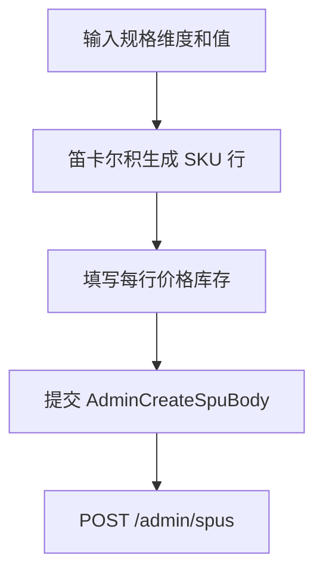

# 管理后台开发设计文档（React）

> **应用路径**：`apps/admin`  
> **技术栈**：React 18、Vite 5、React Router 6、Ant Design 5、Zustand（或 Redux Toolkit）、TanStack Query  
> **依赖文档**：[架构说明书](./轻量电商系统架构说明书.md)、[共享接口与约定](./共享接口与约定.md)

---

## 1. 职责边界

| 负责 | 不负责 |
|------|--------|
| 类目维护、SPU/SKU 发布与上下架、库存调整 | C 端商城展示样式 |
| 订单查询、发货、退货审核 | 支付渠道真实对接 |
| 模拟支付 QA 工具 | 用户注册运营 |

---

## 2. 工程结构

```
apps/admin/
├── index.html
├── vite.config.ts
├── src/
│   ├── main.tsx
│   ├── App.tsx
│   ├── routes/
│   │   ├── index.tsx              # 路由表 + 懒加载
│   │   └── ProtectedRoute.tsx
│   ├── layouts/
│   │   └── AdminLayout.tsx        # 侧边栏 + 顶栏
│   ├── pages/
│   │   ├── Login/
│   │   ├── Dashboard/
│   │   ├── Category/
│   │   │   ├── List.tsx
│   │   │   └── Form.tsx
│   │   ├── Product/
│   │   │   ├── SpuList.tsx
│   │   │   ├── SpuForm.tsx        # 含 SKU 矩阵
│   │   │   └── SkuStockModal.tsx
│   │   ├── Order/
│   │   │   ├── List.tsx
│   │   │   ├── Detail.tsx
│   │   │   └── ShipModal.tsx
│   │   └── DevTools/
│   │       └── MockPay.tsx        # SUPER 权限
│   ├── components/
│   │   ├── SpecMatrixEditor.tsx   # 规格笛卡尔积生成 SKU 行
│   │   ├── ImageUploader.tsx      # 本地预览 + URL（轻量先填 URL）
│   │   └── OrderStatusBadge.tsx
│   ├── services/
│   │   ├── http.ts                # axios 实例
│   │   ├── category.ts
│   │   ├── spu.ts
│   │   ├── order.ts
│   │   └── payment.ts
│   ├── stores/
│   │   └── authStore.ts
│   ├── hooks/
│   │   └── usePermission.ts
│   └── types/                     # from @simplemall/shared
└── package.json
```

---

## 3. 路由设计

| 路径 | 页面 | 权限 |
|------|------|------|
| `/login` | 登录 | 公开 |
| `/` | 仪表盘 | OPERATOR+ |
| `/categories` | 类目列表 | OPERATOR+ |
| `/categories/new` | 新增类目 | OPERATOR+ |
| `/categories/:id/edit` | 编辑 | OPERATOR+ |
| `/products` | SPU 列表 | OPERATOR+ |
| `/products/new` | 发布商品 | OPERATOR+ |
| `/products/:id/edit` | 编辑 SPU/SKU | OPERATOR+ |
| `/orders` | 订单列表 | OPERATOR+ |
| `/orders/:id` | 订单详情 | OPERATOR+ |
| `/dev/mock-pay` | 模拟支付工具 | SUPER |

**ProtectedRoute**：无 token → `/login`；`DevTools` 路由 `role !== SUPER` → 403 页。

---

## 4. 功能模块设计

### 4.1 登录与权限

```typescript
// authStore
interface AuthState {
  token: string | null;
  admin: { id: number; username: string; role: AdminRole } | null;
}
```

- 登录：`POST /admin/auth/login` → 存 `sessionStorage.admin_token`。
- axios 拦截器附加 `Authorization`。
- `usePermission('SUPER')` 控制按钮显隐。

### 4.2 类目管理

| 功能 | UI | API |
|------|-----|-----|
| 树形列表 | Ant Design `Tree` 或 Table 缩进 | GET `/admin/categories` |
| 新增/编辑 | Drawer 表单：name, parentId, sort | POST/PUT |
| 删除 | Popconfirm | DELETE（仅 SUPER，后端校验无子节点、无 SPU） |

### 4.3 商品发布（SPU + SKU 矩阵）

**SpuForm 步骤**（单页表单或 Steps）：

1. **基础信息**：类目（TreeSelect）、标题、主图、多图、富文本详情（轻量可用 TextArea）。
2. **规格定义**：动态添加规格名（如颜色、尺码），每维添加多个值。
3. **SKU 矩阵**：`SpecMatrixEditor` 对规格值笛卡尔积生成行，每行 editable：`price`（元输入转分）、`stock`、`barcode`。
4. **状态**：草稿 / 上架。



**编辑态**：已存在 SKU 的 `id` 需回传；新增行无 id；删除 SKU 可标 `disabled` 或后端软删。

**库存调整**：列表页「调库存」→ `SkuStockModal` → `PATCH /admin/skus/:id/stock` with `{ stock: number }` 或 `{ delta: number }`。

### 4.4 订单管理

**列表筛选项**：

- 订单号、用户手机号、状态（Select）、时间 RangePicker
- 默认 Tab 快捷：`待发货` = `PAID`

| 操作 | 条件 | UI |
|------|------|-----|
| 发货 | status=PAID | ShipModal：物流公司、运单号 |
| 同意退货 | REFUNDING | 确认后调 refund API |
| 查看日志 | 任意 | 详情页 Timeline 展示 status_logs |

**OrderDetail 区块**：商品行、金额、收货人、支付信息、物流、状态时间轴。

### 4.5 模拟支付工具（DEV）

页面 `/dev/mock-pay`：

- 输入 `paymentNo` 或扫订单详情复制
- 选择渠道成功/失败
- 调用 `POST /admin/payments/mock-notify`
- 展示原始响应，便于 QA 联调 C 端

---

## 5. 数据请求（TanStack Query）

```typescript
// 示例：订单列表
export function useAdminOrders(params: OrderQueryParams) {
  return useQuery({
    queryKey: ['admin', 'orders', params],
    queryFn: () => http.get('/admin/orders', { params }).then(r => r.data.data),
  });
}

// 发货 mutation
export function useShipOrder() {
  const qc = useQueryClient();
  return useMutation({
    mutationFn: ({ id, ...body }) => http.patch(`/admin/orders/${id}/ship`, body),
    onSuccess: (_, { id }) => {
      qc.invalidateQueries({ queryKey: ['admin', 'orders'] });
      qc.invalidateQueries({ queryKey: ['admin', 'order', id] });
    },
  });
}
```

---

## 6. UI 规范（Ant Design）

| 项 | 约定 |
|----|------|
| 布局 | 左侧 Sider 固定 200px，内容区 `padding: 24px` |
| 表格 | 分页默认 20；`orderNo` 可复制 |
| 金额 | 列表以元显示，提交转分 |
| 表单 | `rules` 必填；提交 `loading` |
| 消息 | `message.success/error` 统一反馈 |

**菜单结构**：

```
仪表盘
商品管理
  ├ 类目管理
  └ 商品列表
订单管理
  └ 订单列表
开发工具 (SUPER)
  └ 模拟支付
```

---

## 7. 环境变量

```bash
# .env.development
VITE_API_BASE=http://localhost:4000/api/v1
```

`vite.config.ts` proxy（可选）：

```typescript
server: {
  proxy: { '/api': 'http://localhost:4000' },
}
```

---

## 8. 开发任务拆分（Admin）

| 序号 | 任务 | 验收 |
|------|------|------|
| A1 | Vite + Router + Layout + Login | 登录进后台 |
| A2 | 类目 CRUD | 树形表格展示、一级/二级展开、行内「新增子类目」 |
| A3 | SpecMatrixEditor + SpuForm 新建 | 多规格 SKU 提交成功 |
| A4 | SPU 列表、编辑、状态栏 | 未上架/已上架/已售罄/已下架/补货中筛选与切换正确 |
| A5 | SKU 调库存 | 商城端库存同步 |
| A6 | 订单列表 + 详情 | 筛选、时间轴 |
| A7 | 发货 | 订单→SHIPPED |
| A8 | 退货审核 + MockPay | SUPER 可测支付 |

---

## 9. 与 C 端数据一致性

| 检查项 | 说明 |
|--------|------|
| SPU 状态 | 列表展示状态 Tag；支持筛选与行内切换；C 端仅可见已上架/已售罄/补货中 |
| 库存同步 | 调库存后 API 自动同步已上架↔已售罄 |
| 改价 | 仅影响新订单；旧订单快照不变 |
| 调库存 | 实时影响加购与下单校验 |
| 发货后 | C 端订单详情显示物流单号 |

---

## 10. 本地启动

```bash
cd apps/admin
pnpm install
pnpm dev    # 默认 :5173
```

先启动 `apps/api`，使用测试管理员账号（由 seed 脚本创建，见服务端文档）。

---

## 修订记录

| 版本 | 日期 | 说明 |
|------|------|------|
| v1.0 | 2026-06-03 | 初稿：React 路由、SPU 矩阵表单、订单发货 |
