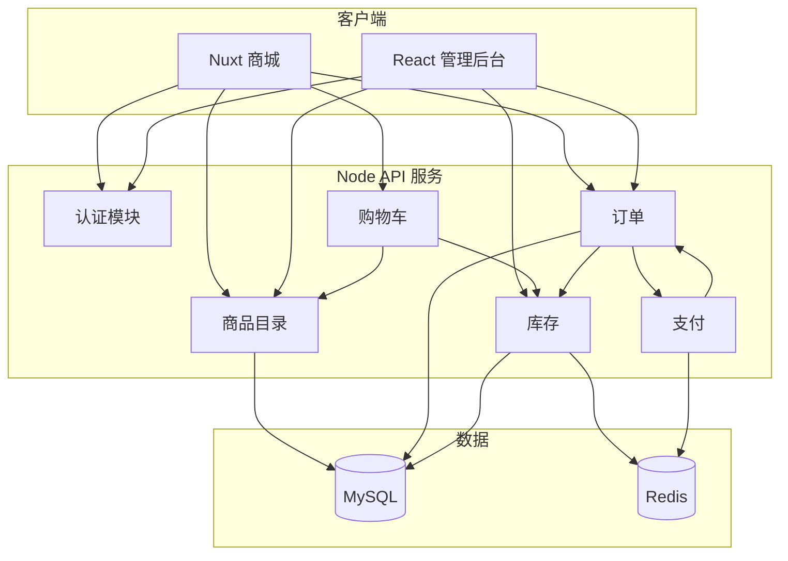
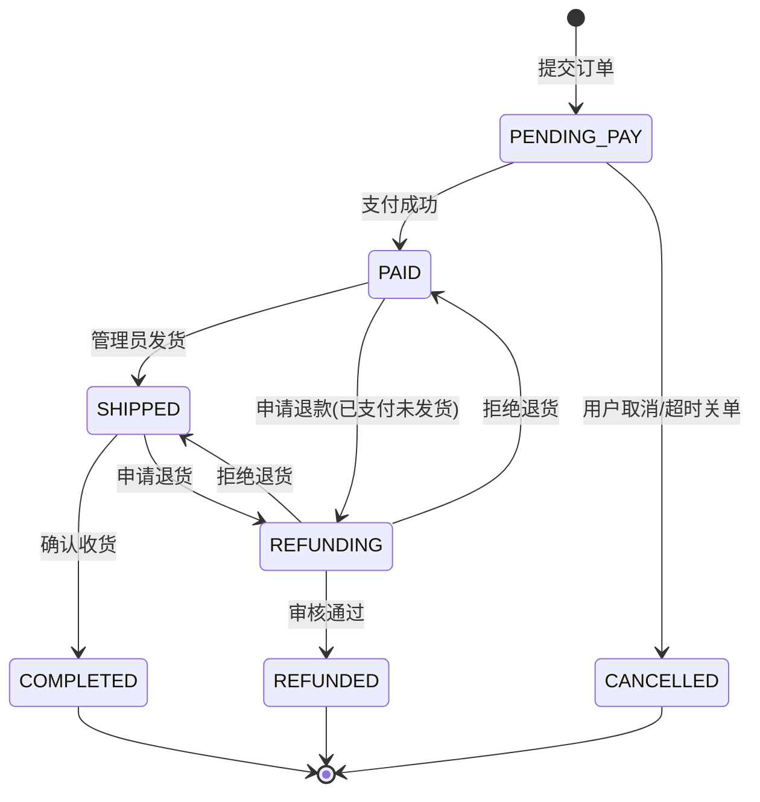
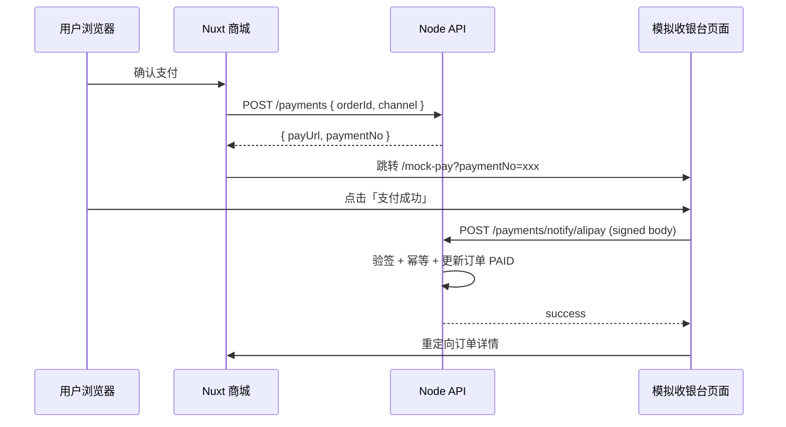
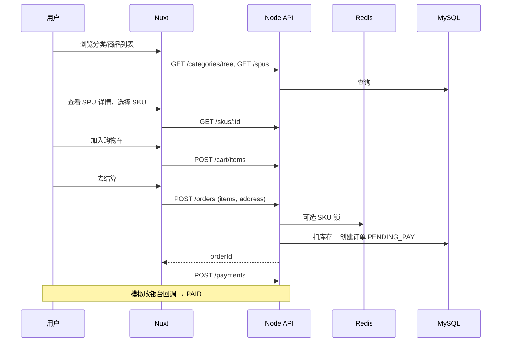

# 轻量电商系统架构说明书

> **SimpleMall** — 面向教学/演示的轻量级 B2C 电商系统  
> 版本：v1.0 | 更新日期：2026-06-03

---

## 1. 文档目的与范围

本文档描述一套**可单机部署、模块清晰、易于扩展**的轻量电商系统整体架构，覆盖：

- 商品发布（SPU/SKU）、多级分类
- C 端浏览、购物车、下单与支付
- 订单全生命周期状态流转
- 库存实时扣减与防超卖
- 支付宝/微信支付**模拟回调**（非生产真实对接）

**不在本期范围**：复杂营销（拼团/秒杀）、多仓 WMS、跨境、发票、真实支付商户进件。

---

## 2. 系统目标与非功能要求

| 维度   | 目标                                             |
| ------ | ------------------------------------------------ |
| 轻量   | 单体或少量服务，MySQL + Redis 即可运行           |
| 一致性 | 下单扣库存、支付改状态在同一事务或可靠补偿内完成 |
| 可观测 | 结构化日志、关键业务埋点（下单/支付/发货）       |
| 安全   | JWT 鉴权、支付回调签名校验（模拟）、管理端 RBAC  |
| 扩展   | 模块边界清晰，后续可拆订单/库存/支付为独立服务   |

---

## 3. 技术栈选型

### 3.1 总体分层

```
┌─────────────────────────────────────────────────────────────┐
│  客户端层                                                    │
│  ┌──────────────┐  ┌──────────────┐  ┌──────────────────┐  │
│  │ Web 商城      │  │ 管理后台      │  │ 支付网关(模拟)    │  │
│  │ Nuxt 3       │  │ React 18     │  │ Node 内置路由     │  │
│  │ (SSR/CSR)    │  │ + Ant Design │  │ /mock-pay/*      │  │
│  └──────┬───────┘  └──────┬───────┘  └────────┬─────────┘  │
└─────────┼─────────────────┼───────────────────┼────────────┘
          │                 │                   │
          └─────────────────┼───────────────────┘
                            ▼
┌─────────────────────────────────────────────────────────────┐
│  API 网关层（可选：Nginx / 开发期直连）                        │
│  统一：/api/v1/*  限流、CORS、静态资源                        │
└─────────────────────────────┬───────────────────────────────┘
                              ▼
┌─────────────────────────────────────────────────────────────┐
│  业务服务层 — Node.js                                        │
│  推荐：NestJS 或 Fastify + 模块化目录                         │
│  模块：auth | catalog | cart | order | inventory | payment   │
└─────────────────────────────┬───────────────────────────────┘
                              ▼
┌─────────────────────────────────────────────────────────────┐
│  数据层                                                      │
│  MySQL 8（主数据）  Redis 7（会话/锁/库存缓存/幂等）           │
└─────────────────────────────────────────────────────────────┘
```

### 3.2 各端技术说明

| 端           | 技术                                                         | 职责                                           |
| ------------ | ------------------------------------------------------------ | ---------------------------------------------- |
| **服务端**   | Node.js 20+，NestJS / Fastify                                | REST API、业务编排、支付回调、库存扣减         |
| **Web 商城** | Nuxt 3 + Pinia + ofetch                                      | 商品列表/详情、购物车、结算、订单查询          |
| **管理后台** | React 18 + Vite + React Router + Ant Design Pro（或 shadcn） | 类目/SPU/SKU、订单发货、库存调整、模拟支付配置 |
| **ORM**      | Prisma 或 TypeORM                                            | 与 MySQL 映射，迁移可版本化                    |
| **缓存/锁**  | ioredis                                                      | 分布式锁、库存预扣、支付幂等键                 |

---

## 4. 逻辑架构与模块划分

### 4.1 模块依赖关系



### 4.2 模块职责

| 模块          | 核心能力                                             |
| ------------- | ---------------------------------------------------- |
| **auth**      | 用户注册登录、JWT 刷新、管理端角色（admin/operator） |
| **catalog**   | 多级分类树、SPU 发布、SKU 规格与价格、上下架         |
| **cart**      | 登录用户购物车 CRUD，合并 SKU 数量，校验可售与库存   |
| **inventory** | 可售库存查询、预占、确认扣减、释放、防超卖           |
| **order**     | 创建订单、状态机、发货、取消/退货                    |
| **payment**   | 创建支付单、跳转模拟收银台、异步回调、幂等更新订单   |

---

## 5. 领域模型

### 5.1 商品：SPU / SKU

- **SPU（Standard Product Unit）**：标准商品，描述「是什么」— 标题、主图、详情、所属类目、品牌等。
- **SKU（Stock Keeping Unit）**：可售卖最小单元，描述「买哪一款」— 规格组合（颜色/尺码）、售价、条码、**可售库存**。

```
Category (树)
    └── SPU
            ├── sku_attr: [{ name: "颜色", value: "红" }, ...]
            └── SKU[] (每个 SKU 独立 price、stock、status)
```

**管理端发布流程**：创建/选择类目 → 填写 SPU 基础信息 → 配置规格矩阵生成 SKU 列表 → 设置各 SKU 价格与初始库存 → 上架（SPU.status = on_sale）。

### 5.2 多级分类

- 表结构：`category(id, parent_id, name, level, sort, path)`
- `path` 示例：`/1/5/12/` 便于按前缀查询子树
- 前台：树形导航 + 面包屑；后台：拖拽排序、禁用节点（子节点一并不可售可选策略）

### 5.3 购物车

| 字段     | 说明     |
| -------- | -------- |
| user_id  | 登录用户 |
| sku_id   | 关联 SKU |
| quantity | 数量     |
| selected | 结算勾选 |

合并规则：同一 `user_id + sku_id` 仅一条记录，数量累加。

### 5.4 订单与订单项

- **order**：订单头（用户、总金额、运费、状态、支付渠道、支付时间、物流单号等）
- **order_item**：快照 `sku_id、spu_title、sku_specs、unit_price、quantity`（防止商品改价影响历史订单）

---

## 6. 订单状态机

### 6.1 状态定义

| 状态码        | 中文   | 说明                                  |
| ------------- | ------ | ------------------------------------- |
| `PENDING_PAY` | 待支付 | 已创建，库存已预占，等待支付          |
| `PAID`        | 已支付 | 支付回调成功，待发货                  |
| `SHIPPED`     | 已发货 | 已填写物流信息                        |
| `COMPLETED`   | 已完成 | 用户确认收货或超时自动完成            |
| `CANCELLED`   | 已取消 | 待支付取消或支付前超时关单            |
| `REFUNDING`   | 退货中 | 用户申请退货/退款审核中（可选子状态） |
| `REFUNDED`    | 已退货 | 库存回滚、支付冲正（模拟）            |

### 6.2 状态流转图



### 6.3 状态变更约束（服务端强制）

- 仅允许**预定义边**迁移；非法迁移返回 `409 ORDER_STATE_INVALID`。
- 每次迁移写 `order_status_log(order_id, from, to, operator, remark, created_at)`。
- 关单/取消：释放预占库存；退款完成：回滚已扣库存（见第 7 节）。

---

## 7. 库存与防超卖

### 7.1 库存模型

| 概念                     | 存储                                    | 说明           |
| ------------------------ | --------------------------------------- | -------------- |
| **可售库存** `available` | MySQL `sku.stock` + Redis 缓存          | 对外展示与校验 |
| **预占库存** `reserved`  | Redis / 表 `inventory_reservation`      | 下单未支付占用 |
| **已售扣减**             | 支付成功后从 `available` 扣减并清理预占 | 实扣           |

轻量方案推荐：**MySQL 行级乐观锁 + Redis 分布式锁（热点 SKU）**。

### 7.2 下单扣减流程

```
1. 创建订单前：校验每个 SKU 的 available >= quantity
2. 开启 DB 事务：
   a. UPDATE sku SET stock = stock - qty, version = version + 1
      WHERE id = ? AND stock >= qty AND version = ?
   b. 若 affected_rows = 0 → 回滚，返回库存不足
   c. INSERT inventory_reservation (order_id, sku_id, qty, expire_at)
3. 提交事务；订单状态 = PENDING_PAY
4. 支付超时任务：释放 reservation，stock 加回（或仅减 reserved 计数）
5. 支付成功回调：
   a. 确认 reservation → 实扣已完成（步骤 2 已从 available 扣减）
      或采用「仅预占 reserved、支付成功再扣 available」两阶段（见下）
```

**两阶段（更常见、便于取消）：**

| 阶段      | 操作                                                   |
| --------- | ------------------------------------------------------ |
| 下单      | `available -= n`, `reserved += n`（同一事务 + 乐观锁） |
| 支付成功  | `reserved -= n`（实占完成）                            |
| 取消/超时 | `available += n`, `reserved -= n`                      |

### 7.3 防超卖要点

1. **禁止**先查库存再异步扣减的无锁写法。
2. 扣减 SQL 必须带 `WHERE stock >= ?`。
3. 热点商品用 Redis `SET key NX EX` 或 Redlock 串行化同一 `sku_id` 的扣减。
4. 购物车结算与下单接口**再次校验**库存（防止页面停留过久）。
5. 管理端调库存走独立接口并记审计日志。

### 7.4 与购物车联动

- 加购：只读校验 `available > 0`，不锁库存。
- 结算页：实时拉取 SKU 库存。
- 提交订单：触发预占/扣减（上节流程）。

---

## 8. 支付与模拟回调

### 8.1 支付单

| 字段       | 说明                          |
| ---------- | ----------------------------- |
| payment_no | 系统支付流水号                |
| order_id   | 业务订单                      |
| channel    | `ALIPAY` \| `WECHAT`          |
| amount     | 应付金额（分）                |
| status     | `INIT` / `SUCCESS` / `CLOSED` |
| notify_raw | 回调原文 JSON                 |

### 8.2 模拟收银台流程



### 8.3 回调接口设计

| 渠道       | 路径                                  | 说明                                 |
| ---------- | ------------------------------------- | ------------------------------------ |
| 支付宝模拟 | `POST /api/v1/payments/notify/alipay` | 仿 `trade_status=TRADE_SUCCESS` 结构 |
| 微信模拟   | `POST /api/v1/payments/notify/wechat` | 仿 V3 解密后 resource 结构           |

**处理步骤（必须）：**

1. 校验模拟签名头 `X-Mock-Sign`（HMAC-SHA256，密钥配置在环境变量）。
2. Redis 幂等键 `pay:notify:{payment_no}`，TTL 24h，重复回调直接返回 success。
3. 事务内：`payment.status = SUCCESS` 且 `order.status: PENDING_PAY → PAID`，写状态日志。
4. 确认库存预占（若采用两阶段则在此完成 `reserved` 清理）。
5. 返回渠道要求的 success 字符串（如 `success` / JSON `{ code: SUCCESS }`）。

### 8.4 管理端配置

- 开关：是否启用模拟支付、默认支付渠道。
- 测试工具页：按 `payment_no` 手动触发成功/失败回调（便于 QA）。

---

## 9. 核心业务流程

### 9.1 C 端：浏览 → 加购 → 下单 → 支付



### 9.2 管理端：发货

1. 订单列表筛选 `status=PAID`。
2. 填写物流公司、运单号 → `PATCH /admin/orders/:id/ship`。
3. 状态 → `SHIPPED`，可选发送站内通知（轻量可省略）。

### 9.3 取消与退货

| 场景             | 触发          | 库存           | 支付         |
| ---------------- | ------------- | -------------- | ------------ |
| 待支付取消       | 用户/超时任务 | 释放预占       | 无           |
| 已支付未发货退款 | 审核通过      | 回滚 available | 模拟退款接口 |
| 已发货退货       | 退货入库后    | 回滚 available | 模拟退款     |

---

## 10. API 设计概要

**约定**：`/api/v1` 前缀；JSON；错误体 `{ code, message, requestId }`。

### 10.1 商品与分类（C 端 + 管理端）

| 方法  | 路径                    | 说明                       |
| ----- | ----------------------- | -------------------------- |
| GET   | `/categories/tree`      | 前台类目树                 |
| GET   | `/spus`                 | 列表（分页、类目、关键词） |
| GET   | `/spus/:id`             | 详情含 SKU 列表            |
| POST  | `/admin/spus`           | 创建 SPU + SKU             |
| PUT   | `/admin/spus/:id`       | 更新                       |
| PATCH | `/admin/skus/:id/stock` | 调整库存                   |

### 10.2 购物车

| 方法   | 路径              | 说明                  |
| ------ | ----------------- | --------------------- |
| GET    | `/cart`           | 当前用户购物车        |
| POST   | `/cart/items`     | `{ skuId, quantity }` |
| PUT    | `/cart/items/:id` | 改数量                |
| DELETE | `/cart/items/:id` | 删除                  |

### 10.3 订单

| 方法 | 路径                 | 说明                   |
| ---- | -------------------- | ---------------------- |
| POST | `/orders`            | 从购物车或直接购买创建 |
| GET  | `/orders`            | 我的订单               |
| GET  | `/orders/:id`        | 详情                   |
| POST | `/orders/:id/cancel` | 待支付取消             |

### 10.4 支付

| 方法 | 路径                      | 说明           |
| ---- | ------------------------- | -------------- |
| POST | `/payments`               | 发起支付       |
| POST | `/payments/notify/alipay` | 模拟支付宝回调 |
| POST | `/payments/notify/wechat` | 模拟微信回调   |

---

## 11. 数据库表清单（逻辑）

```
users                 -- C 端用户
admins                -- 后台账号
roles, admin_roles    -- RBAC

categories            -- 多级分类
spus                  -- 标准商品
skus                  -- SKU（price, stock, specs_json, status）
sku_media             -- 可选：SPU 图集

carts, cart_items     -- 购物车

orders                -- 订单头
order_items           -- 订单行快照
order_status_logs     -- 状态审计

inventory_reservations -- 预占记录（可选）
payments                -- 支付单

addresses               -- 用户收货地址（轻量单表）
```

**索引建议**：`skus(spu_id)`, `orders(user_id, status)`, `order_items(order_id)`, `categories(parent_id)`.

---

## 12. 部署架构（轻量）

```
                    ┌─────────────┐
                    │   Nginx     │
                    │  :80 / :443 │
                    └──────┬──────┘
           ┌───────────────┼───────────────┐
           ▼               ▼               ▼
    ┌────────────┐  ┌────────────┐  ┌────────────┐
    │ Nuxt (SSR) │  │ React Admin│  │ Node API   │
    │   :3000    │  │   :5173    │  │   :4000    │
    └────────────┘  └────────────┘  └─────┬──────┘
                                            │
                              ┌─────────────┴─────────────┐
                              ▼                           ▼
                        ┌──────────┐               ┌──────────┐
                        │  MySQL   │               │  Redis   │
                        └──────────┘               └──────────┘
```

**环境变量示例**：`DATABASE_URL`, `REDIS_URL`, `JWT_SECRET`, `MOCK_PAY_SIGN_SECRET`, `ORDER_PAY_TIMEOUT_MINUTES=30`.

**定时任务**（Node `cron` 或独立 worker）：

- 扫描 `PENDING_PAY` 且创建时间超过 30 分钟 → 关单并释放库存。
- 扫描 `SHIPPED` 超过 N 天 → 自动 `COMPLETED`（可选）。

---

## 13. 安全与合规（轻量基线）

- 密码 bcrypt；JWT access 短过期 + refresh。
- 管理端接口统一 `AdminGuard` + 角色校验。
- 支付回调仅接受内网或带签名的模拟请求；生产需换真实证书与 IP 白名单。
- 敏感配置不入库、不进 Git。

---

## 14. 目录结构建议（Monorepo）

```
SimpleMall/
├── apps/
│   ├── api/              # NestJS / Fastify 服务端
│   ├── web/              # Nuxt 3 商城
│   └── admin/            # React 管理后台
├── packages/
│   └── shared/           # 共享类型、枚举、常量（OrderStatus 等）
├── docs/
│   ├── README.md                      # 文档索引
│   ├── 轻量电商系统架构说明书.md
│   ├── 共享接口与约定.md
│   ├── 服务端开发设计文档.md
│   ├── Web商城开发设计文档.md
│   └── 管理后台开发设计文档.md
├── docker-compose.yml    # MySQL + Redis + 可选三端
└── package.json          # pnpm workspace
```

---

## 15. 实施阶段建议

| 阶段 | 交付物                                    |
| ---- | ----------------------------------------- |
| P0   | 类目 + SPU/SKU CRUD、库存字段、管理端上架 |
| P1   | Nuxt 列表/详情/购物车、下单预占库存       |
| P2   | 模拟支付 + 回调幂等、订单状态机           |
| P3   | 发货/完成/取消退货、超时关单任务          |
| P4   | 监控日志、压测热点 SKU 防超卖             |

---

## 16. 附录：关键枚举（共享包）

```typescript
// packages/shared/src/enums.ts（示意）

export enum OrderStatus {
  PENDING_PAY = "PENDING_PAY",
  PAID = "PAID",
  SHIPPED = "SHIPPED",
  COMPLETED = "COMPLETED",
  CANCELLED = "CANCELLED",
  REFUNDING = "REFUNDING",
  REFUNDED = "REFUNDED",
}

export enum PayChannel {
  ALIPAY = "ALIPAY",
  WECHAT = "WECHAT",
}

export enum SpuStatus {
  DRAFT = "DRAFT",
  ON_SALE = "ON_SALE",
  OFF_SALE = "OFF_SALE",
}
```

---

## 17. 修订记录

| 版本 | 日期       | 说明                                          |
| ---- | ---------- | --------------------------------------------- |
| v1.0 | 2026-06-03 | 初稿：覆盖 Node + Nuxt + React 轻量电商全链路 |

---

**文档维护**：架构变更请同步更新本文档第 6～8 节（状态机、库存、支付）及 API 概要表。
